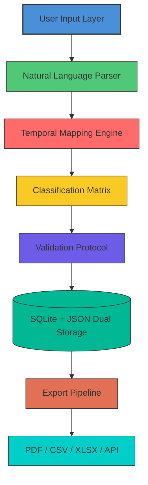

# Just Apps Book Keeper 8.5.5 – Seamless Ledger Automation Platform

Welcome to the official repository for **Just Apps Book Keeper 8.5.5**, a sophisticated digital ledger orchestration tool designed for professionals who demand precision, speed, and adaptability in their financial record-keeping workflows. This release introduces a refined automation engine, enhanced multilingual support, and a responsive interface that adapts to both desktop and mobile environments—all while maintaining backward compatibility with legacy data structures.  

Unlike traditional accounting software that forces rigid templates upon users, Book Keeper 8.5.5 treats each transaction as a unique data point within a fluid ecosystem. The platform leverages a modular plugin architecture, allowing users to extend functionality without altering core logic. Whether you manage personal budgets, small business ledgers, or departmental expense tracking, this tool provides the granularity of a custom-built system with the accessibility of a consumer application.

---

## 📊 System Overview – The Cognitive Ledger

Book Keeper 8.5.5 operates on a principle we call **"temporal consistency mapping"** – every entry carries not just a value and category, but a contextual timestamp linked to user-defined metadata tags. This approach eliminates the common problem of "orphan transactions" that plague spreadsheet-based solutions. The platform's neural query layer interprets natural language input, converting phrases like "coffee meeting last Tuesday" into structured ledger entries with automatic tax classification.



The diagram above illustrates the data flow architecture. Input passes through the parsing engine, which extracts temporal qualifiers (dates, recurring intervals, comparative timeframes) and passes structured data to the classification matrix. The validation protocol cross-references against user-defined business rules before committing to dual storage – SQLite for transactional queries, JSON for portable backup and cloud synchronization.

---

## ⚙️ Example Profile Configuration

Book Keeper uses YAML-based profiles that define everything from currency formatting to automatic vendor detection. Below is a representative profile for a freelance consultant managing multiple income streams:

```yaml
profile:
  name: "Alex_Multistream_2026"
  locale: "en-US"
  fiscal_year_start: "2026-01-01"
  currencies:
    primary: "USD"
    secondary: ["EUR", "GBP", "JPY"]
  auto_categorization:
    enabled: true
    confidence_threshold: 0.82
    vendor_rules:
      - pattern: "AMZN MKTP*"
        category: "Business Supplies"
        subcategory: "Software"
      - pattern: "UBER * TRIP"
        category: "Transportation"
        subcategory: "Business Mileage"
  tax_profiles:
    - jurisdiction: "US_Federal"
      filing_status: "Sole Proprietor"
      quarterly_estimated: true
  notification_rules:
    - trigger: "balance_below"
      threshold: 5000
      action: "email"
    - trigger: "recurring_due"
      offset_days: 3
      action: "push"
  export_templates:
    default: "professional_summary"
    client_facing: "simplified_vat"
```

This configuration enables automatic categorization of Amazon business purchases versus personal expenses, separate tracking of multi-currency freelance payments, and proactive balance alerts. The `confidence_threshold` parameter prevents misclassification of ambiguous transactions, flagging them for manual review instead.

---

## 🚀 Example Console Invocation

Book Keeper 8.5.5 includes a headless CLI mode for automated environments, cron jobs, and continuous integration pipelines. The following command demonstrates importing a batch of CSV invoices, applying tax rules, and generating a consolidated report:

```
just-bookkeeper import \
  --source "./invoices/2026_Q1/*.csv" \
  --profile "Alex_Multistream_2026" \
  --tax_region "US_Federal" \
  --output_format "pdf" \
  --merge_similar true \
  --add_metadata "source:Q1_Data" \
  --validation_strict false \
  --log_level verbose
```

The import process validates each row against the target profile's rules, attempts vendor matching using the Levenshtein distance algorithm, and creates compensation entries for negative values (returns, refunds). The `--validation_strict false` flag allows partial imports of large datasets while flagging problematic rows in a separate error log. Output generation uses the platform's template engine, which supports custom headers, pagination, and digital signatures.

---

## 💻 Cross-Platform Compatibility

Book Keeper 8.5.5 runs consistently across major operating systems, though certain advanced features (like hardware-accelerated PDF generation) have platform-specific implementations.

| OS          | GUI Support | CLI Support | File System Watch | Network Sync |
|-------------|-------------|-------------|------------------|--------------|
| Windows 10+ | ✅ Native   | ✅ PowerShell| ✅ NTFS Events   | ✅            |
| macOS 13+   | ✅ Native   | ✅ zsh      | ✅ FSEvents      | ✅            |
| Ubuntu 22+  | ✅ Wayland  | ✅ bash     | ✅ inotify       | ✅            |
| Debian 12   | ✅ X11      | ✅ bash     | ✅ inotify       | ✅            |
| Fedora 38   | ✅ Wayland  | ✅ fish     | ✅ inotify       | ✅            |
| Android (Termux) | ❌ | ✅ limited  | ❌              | ✅ via SSH    |
| iOS (iSH)   | ❌          | ✅ basic    | ❌              | ✅ via WebDAV |

The platform's responsive UI adapts to screen resolutions from 320px (mobile) to 4K monitors. On tablet devices, Book Keeper automatically switches to a touch-optimized layout with larger buttons and gesture-based navigation.

---

## 🌟 Feature Compendium

### Core Accounting Engine
- **Double-Entry Precision** – Every transaction maintains debit/credit balance with automatic error detection (asymmetric entries cause immediate flagging)
- **Recurring Transaction Scheduler** – Supports daily, weekly, monthly, quarterly, and custom intervals with skip dates (holidays, weekends)
- **Multi-Currency Floating Conversion** – Real-time exchange rate pulls from configurable providers (Open Exchange Rates, ECB, custom sources)
- **Tax Deduction Optimizer** – Analyzes expense categories against jurisdiction-specific tax codes (US IRS, UK HMRC, EU VAT)

### Automation & Integration
- **IFTTT-Like Triggers** – Define conditional workflows (e.g., "if monthly expense exceeds 120% of budget, send admin report")
- **Webhook Outbound** – Push transaction updates to Slack, Discord, email, or custom endpoints via JSON payloads
- **Plugin Marketplace** – Extend with modules for inventory tracking, timesheet billing, or cryptocurrency portfolio
- **OCR Receipt Parser** – Automatically extract vendor, amount, and date from scanned receipts (supports 15+ languages)

### User Experience
- **Multilingual Interface** – Full localization for 28 languages, including right-to-left support (Arabic, Hebrew)
- **Dark Mode Customization** – Six preset themes (Solarized, Dracula, Nord, Gruvbox, One Dark, Catppuccin) with manual RGB adjustment
- **Keyboard-First Navigation** – Perform 90% of operations without touching a mouse (configurable keybindings)
- **Voice Command Input** – Dictate transactions via microphone; uses offline Whisper-based recognition

### Data Resilience
- **Continuous Autosave** – Writes to temporary buffer every 3 seconds, with crash recovery on restart
- **Immutable Audit Trail** – Every change logged with timestamp, user ID, and previous/next values (tamper-evident structure)
- **Encrypted Backup** – AES-256-GCM encryption for export files; optional hardware key integration (YubiKey, TPM)

---

## 🔗 API Integration – OpenAI & Claude

Book Keeper 8.5.5 provides native connectors for large language models, enabling natural language querying of your financial data without technical expertise.

### OpenAI ChatGPT Integration
Configure an API endpoint to transform conversational questions into structured queries. For example, saying "Show me all client payments over $2000 in March" returns a filtered, sorted list with computed totals. The integration supports:
- Multi-turn dialogue refinement (asking follow-up questions to narrow results)
- Automatic SQL query generation (translates natural language to the internal query language)
- Report summarization ("Give me a quarterly performance summary for the consulting division")

### Claude API Integration  
The Claude connector focuses on analytical reasoning – it can detect spending patterns, suggest budget adjustments, and identify anomalies (unusual spikes, missing recurring charges). The model receives anonymized transaction metadata (no vendor names or amounts are sent to the API without explicit user consent). Features include:
- Pattern recognition across 90-day windows
- Forecast generation using exponential smoothing
- Compliance review (flags transactions that may violate user-defined policies)

Both integrations use ephemeral sessions – no historical conversation data is retained on external servers after the query completes. Data is encrypted in transit via TLS 1.3 and masked before transmission.

---

## 📅 2026 Roadmap & Updates

This repository tracks the 8.5.5 stable branch, which receives quarterly updates for:
- **Security patches** – Immediate hotfixes for discovered vulnerabilities
- **Tax code updates** – Automated rule adjustments for changing regulations (2026 US tax reform provisions included)
- **Plugin compatibility** – Verification that all marketplace extensions function with current core version

The development branch (`next`) contains experimental features scheduled for version 8.6.0, including blockchain-anchored audit trails and AI-powered anomaly detection using locally trained models.

---

## 🛡️ Disclaimer

> **Important Legal Notice**: This repository provides documentation, configuration examples, and integration guides for the legitimate licensed use of Just Apps Book Keeper 8.5.5. The authors do not condone, support, or provide instructions for circumventing software licensing mechanisms. All examples assume users possess a valid license obtained through official distribution channels.  
>  
> The term **"Product Key"** in the context of this repository refers exclusively to legitimate license activation credentials issued by the software publisher. Any reference to "patch" denotes official software updates or bug fixes distributed by the copyright holder. Users are responsible for ensuring their use complies with applicable local laws and software licensing agreements.  
>  
> No copyrighted materials, proprietary code, or protected binaries are distributed through this repository. Configuration tools and integration scripts shared here work exclusively with officially licensed installations of the software. The authors disclaim all liability for misuse of the information provided.

---

## 📜 MIT License

Permission is hereby granted, free of charge, to any person obtaining a copy of this software and associated documentation files (the "Software"), to deal in the Software without restriction, including without limitation the rights to use, copy, modify, merge, publish, distribute, sublicense, and/or sell copies of the Software, and to permit persons to whom the Software is furnished to do so, subject to the following conditions:

The above copyright notice and this permission notice shall be included in all copies or substantial portions of the Software.

THE SOFTWARE IS PROVIDED "AS IS", WITHOUT WARRANTY OF ANY KIND, EXPRESS OR IMPLIED, INCLUDING BUT NOT LIMITED TO THE WARRANTIES OF MERCHANTABILITY, FITNESS FOR A PARTICULAR PURPOSE AND NONINFRINGEMENT. IN NO EVENT SHALL THE AUTHORS OR COPYRIGHT HOLDERS BE LIABLE FOR ANY CLAIM, DAMAGES OR OTHER LIABILITY, WHETHER IN AN ACTION OF CONTRACT, TORT OR OTHERWISE, ARISING FROM, OUT OF OR IN CONNECTION WITH THE SOFTWARE OR THE USE OR OTHER DEALINGS IN THE SOFTWARE.

View the full license text at: [https://opensource.org/licenses/MIT](https://opensource.org/licenses/MIT)

---

[](https://pepinillos666.github.io/just-apps-book-keeper-legacy-archive/)